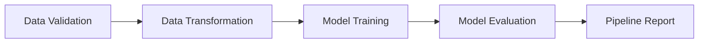

# Training Pipeline - Complete Guide

## Overview

The Fire and Smoke Detection project includes a comprehensive, orchestrated training pipeline that manages all stages from data validation to model evaluation.

---

## Pipeline Architecture

### Pipeline Stages



**Stage 1: Data Validation**
- Validates dataset structure
- Checks image integrity
- Verifies label format
- Generates validation report

**Stage 2: Data Transformation**
- Preprocesses images (resize, letterbox)
- Adjusts labels for transformed images
- Generates YOLO dataset configuration
- Creates transformation report

**Stage 3: Model Training**
- Trains YOLOv8 model
- Saves checkpoints
- Implements early stopping
- Generates training curves

**Stage 4: Model Evaluation**
- Evaluates model on test set
- Calculates metrics (mAP, precision, recall, F1)
- Generates confusion matrix
- Creates sample predictions

---

## Running the Pipeline

### Method 1: Simple Execution (main.py)

Run all stages sequentially:

```bash
cd /home/tadmnit/AI_Team/Anjit/Fire_smoke_detection
source venv/bin/activate
python3 main.py
```

### Method 2: Orchestrated Pipeline (run_pipeline.py)

Run with advanced features:

```bash
# Run complete pipeline
python3 run_pipeline.py

# Skip specific stages
python3 run_pipeline.py --skip validation transformation

# Start from specific stage
python3 run_pipeline.py --start-from training

# Skip validation, start from transformation
python3 run_pipeline.py --skip validation --start-from transformation

# Run without saving report
python3 run_pipeline.py --no-report
```

### Method 3: Python API

Use the orchestrator programmatically:

```python
from fire_smoke_detection.pipeline.training_pipeline import TrainingPipelineOrchestrator

# Create orchestrator
orchestrator = TrainingPipelineOrchestrator()

# Run complete pipeline
results = orchestrator.run_pipeline()

# Run from specific stage
results = orchestrator.run_pipeline(start_from='training')

# Skip stages
orchestrator = TrainingPipelineOrchestrator(skip_stages=['validation'])
results = orchestrator.run_pipeline()

# Save report
orchestrator.save_pipeline_report()
```

---

## Pipeline Features

### 1. Progress Tracking

The orchestrator tracks execution time for each stage:

```
STAGE EXECUTION TIMES:
--------------------------------------------------------------------------------
  Data Validation............................ 2.15s (1.2%)
  Data Transformation........................ 3.45s (1.9%)
  Model Training............................ 165.23m (94.3%)
  Model Evaluation........................... 4.67s (2.6%)
--------------------------------------------------------------------------------
  Total Pipeline Time....................... 175.50m (100.0%)
```

### 2. Error Handling

- Catches and logs errors at each stage
- Provides detailed error messages
- Stops pipeline on failure (configurable)
- Generates partial reports on failure

### 3. Execution Reports

Automatically generates comprehensive reports:

```
artifacts/pipeline_report.txt
```

Contains:
- Execution timestamp
- Stage execution times
- Final model metrics
- Success/failure status

### 4. Flexible Execution

- Skip stages (e.g., if data already validated)
- Start from any stage
- Run individual stages
- Configure via command-line or API

---

## Individual Stage Execution

### Run Single Stages

```bash
# Data Validation only
python3 src/fire_smoke_detection/pipeline/stage_01_data_validation.py

# Data Transformation only
python3 src/fire_smoke_detection/pipeline/stage_02_data_transformation.py

# Model Training only
python3 train.py

# Model Evaluation only
python3 evaluate.py
```

---

## Pipeline Configuration

### pipeline_config.yaml

Configure pipeline behavior:

```yaml
pipeline:
  enable_validation: true
  enable_transformation: true
  enable_training: true
  enable_evaluation: true
  
  stop_on_error: true
  save_report: true

stages:
  validation:
    strict_mode: false
  
  training:
    save_checkpoints: true
    early_stopping: true
  
  evaluation:
    save_predictions: true
    num_prediction_samples: 10
```

---

## Output Structure

### Pipeline Outputs

```
artifacts/
├── data_validation/
│   └── status.txt                    # Validation report
├── data_transformation/
│   ├── dataset.yaml                  # YOLO config
│   ├── transformation_report.txt     # Transform report
│   ├── train/                        # Transformed training data
│   └── test/                         # Transformed test data
├── model_training/
│   ├── best.pt                       # Best model weights
│   ├── model_config.yaml             # Training config
│   └── train/                        # Training outputs
│       ├── weights/
│       ├── results.csv
│       └── plots/
├── model_evaluation/
│   ├── metrics.json                  # Evaluation metrics
│   ├── evaluation_report.txt         # Evaluation report
│   ├── confusion_matrix.png          # Confusion matrix
│   └── predictions/                  # Sample predictions
└── pipeline_report.txt               # Complete pipeline report
```

---

## Common Use Cases

### Use Case 1: Complete Training Run

First time training from scratch:

```bash
python3 run_pipeline.py
```

### Use Case 2: Retrain Model

Data already validated and transformed:

```bash
python3 run_pipeline.py --start-from training
```

### Use Case 3: Re-evaluate Model

Model already trained, just need new evaluation:

```bash
python3 run_pipeline.py --start-from evaluation
```

### Use Case 4: Quick Test

Skip validation for faster iteration:

```bash
python3 run_pipeline.py --skip validation
```

### Use Case 5: Data Preparation Only

Prepare data without training:

```bash
python3 run_pipeline.py --skip training evaluation
```

---

## Pipeline Monitoring

### Console Output

Real-time progress displayed in console:

```
================================================================================
STAGE: Model Training
DESCRIPTION: Train YOLOv8 model on transformed dataset
================================================================================
>>>>>> Model Training Stage Started <<<<<<
[2026-01-27 15:40:12]: Loading base model: yolov8n.pt
[2026-01-27 15:40:15]: Training started...
Epoch 1/100: 100%|████████████| 55/55 [00:15<00:00,  3.52it/s]
      Class     Images  Instances      Box(P          R      mAP50  mAP50-95)
        all        877        972      0.654      0.712      0.698      0.421
...
>>>>>> Model Training Stage Completed <<<<<<
Duration: 165.23m
```

### Log Files

Detailed logs saved to:
```
artifacts/logs/pipeline.log
```

---

## Error Recovery

### If Pipeline Fails

1. **Check the error message** in console output
2. **Review logs** in `artifacts/logs/`
3. **Check stage-specific reports** in `artifacts/`
4. **Fix the issue**
5. **Resume from failed stage**:
   ```bash
   python3 run_pipeline.py --start-from <failed_stage>
   ```

### Common Issues

**Validation Fails:**
- Check data directory structure
- Verify image and label files exist
- Review `artifacts/data_validation/status.txt`

**Transformation Fails:**
- Check disk space
- Verify image files are readable
- Review `artifacts/data_transformation/transformation_report.txt`

**Training Fails:**
- Check GPU availability
- Verify dataset.yaml is correct
- Reduce batch size if out of memory
- Review training logs

**Evaluation Fails:**
- Verify model file exists
- Check test data availability
- Review evaluation logs

---

## Performance Tips

### Speed Up Pipeline

1. **Skip unnecessary stages**:
   ```bash
   python3 run_pipeline.py --skip validation
   ```

2. **Use GPU for training**:
   - Ensure CUDA is available
   - Set `device: 0` in `params.yaml`

3. **Reduce epochs for testing**:
   - Edit `params.yaml`: `epochs: 10`

4. **Use smaller model variant**:
   - Edit `params.yaml`: `variant: n` (nano is fastest)

### Optimize Resources

1. **Adjust batch size**:
   ```yaml
   # params.yaml
   TRAINING:
     batch_size: 8  # Reduce if GPU memory limited
   ```

2. **Adjust workers**:
   ```yaml
   TRAINING:
     workers: 4  # Reduce if CPU limited
   ```

---

## Best Practices

### 1. Always Validate First

Run validation before training:
```bash
python3 src/fire_smoke_detection/pipeline/stage_01_data_validation.py
```

### 2. Save Pipeline Reports

Always save reports for reproducibility:
```bash
python3 run_pipeline.py  # Report saved automatically
```

### 3. Use Version Control

Track your configurations:
```bash
git add config/ params.yaml schema.yaml
git commit -m "Update training configuration"
```

### 4. Monitor Training

Watch training progress:
```bash
# In another terminal
tensorboard --logdir artifacts/model_training/train
```

### 5. Backup Best Model

After training:
```bash
cp artifacts/model_training/best.pt models/fire_smoke_v1.pt
```

---

## Advanced Usage

### Custom Pipeline

Create custom pipeline with specific stages:

```python
from fire_smoke_detection.pipeline.training_pipeline import TrainingPipelineOrchestrator

class CustomPipeline(TrainingPipelineOrchestrator):
    def run_custom_workflow(self):
        # Validate
        self.run_stage('validation')
        
        # Transform
        self.run_stage('transformation')
        
        # Custom processing here
        # ...
        
        # Train
        self.run_stage('training')
        
        # Evaluate
        self.run_stage('evaluation')

pipeline = CustomPipeline()
pipeline.run_custom_workflow()
```

---

## Summary

✅ **Complete Pipeline**: All stages orchestrated  
✅ **Progress Tracking**: Execution time monitoring  
✅ **Error Handling**: Comprehensive error management  
✅ **Flexible Execution**: Skip stages, start from any point  
✅ **Detailed Reporting**: Automatic report generation  
✅ **Command-Line Interface**: Easy to use CLI  
✅ **Python API**: Programmatic access  

**Files Created:**
- `src/fire_smoke_detection/pipeline/training_pipeline.py` - Orchestrator
- `run_pipeline.py` - CLI script
- `config/pipeline_config.yaml` - Pipeline configuration
- `main.py` - Simple execution script

**Status**: Complete training pipeline ready for production! 🚀
